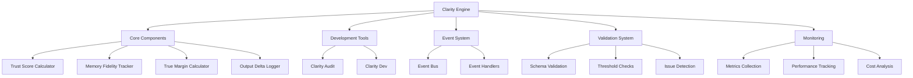

# Clarity Engine Primer
Version 6.2.1

## Overview
The Clarity Engine is a comprehensive system for ensuring high-quality, trustworthy AI interactions. It provides tools for monitoring, validating, and optimizing prompts and their outputs.

## Architecture Map



## CLI Guide

### Installation
```bash
# Install dependencies
pnpm install

# Build the project
pnpm build
```

### Core Commands

#### Audit System
```bash
# Run full system audit
pnpm run clarity-audit

# Generate audit report
pnpm run clarity-audit:report

# Run specific pillar tests
pnpm run clarity-audit:trust
pnpm run clarity-audit:fidelity
pnpm run clarity-audit:cost
```

#### Development Workflow
```bash
# Start development environment
pnpm run clarity-dev

# Watch specific directories
pnpm run clarity-dev --watch prompts,gpt-templates

# Set custom thresholds
pnpm run clarity-dev --trust 4.5 --fidelity 0.9
```

## Development Workflow

1. **Setup**
   - Clone repository
   - Install dependencies
   - Configure environment variables

2. **Development**
   - Start development environment
   - Make changes
   - Monitor metrics
   - Address issues

3. **Testing**
   - Run unit tests
   - Run integration tests
   - Run system tests

4. **Deployment**
   - Run full audit
   - Generate reports
   - Deploy changes

## Metrics and Monitoring

### Core Metrics
- Trust Score (0-5)
- Memory Fidelity (0-1)
- Cost Efficiency (0-1)
- Emotional Resonance (0-1)

### Thresholds
- Trust Score: 4.2
- Memory Fidelity: 0.85
- Cost Efficiency: 0.8
- Emotional Resonance: 0.7

## Testing Strategy

### Unit Tests
- Component-level tests
- Function-level tests
- Edge case coverage

### Integration Tests
- Component interaction tests
- Event system tests
- Data flow tests

### System Tests
- End-to-end tests
- Performance tests
- Load tests

## Security and Compliance

### Security Measures
- Input validation
- Output sanitization
- Access control
- Audit logging

### Compliance Requirements
- Data privacy
- Ethical guidelines
- Industry standards
- Regulatory compliance

## Contributor Onboarding

### Prerequisites
- Node.js 18+
- pnpm 8+
- Git
- IDE with TypeScript support

### Setup Steps
1. Fork repository
2. Clone fork
3. Install dependencies
4. Configure environment
5. Run tests
6. Start development

### Development Guidelines
- Follow TypeScript best practices
- Write comprehensive tests
- Document code changes
- Follow commit conventions
- Review pull requests

### Code Review Process
1. Create feature branch
2. Make changes
3. Run tests
4. Submit PR
5. Address feedback
6. Merge changes

## Performance Optimization

### Optimization Targets
- Response time
- Memory usage
- CPU utilization
- Network efficiency

### Optimization Techniques
- Caching
- Lazy loading
- Batch processing
- Resource pooling

## Continuous Improvement

### Feedback Loops
- User feedback
- System metrics
- Error reports
- Performance data

### Improvement Process
1. Collect data
2. Analyze trends
3. Identify issues
4. Implement fixes
5. Verify improvements

## Emergency Protocols

### Critical Issues
1. Stop affected services
2. Notify stakeholders
3. Investigate root cause
4. Implement fix
5. Verify resolution
6. Document incident

### Recovery Procedures
1. Restore from backup
2. Verify system state
3. Resume services
4. Monitor metrics
5. Update documentation

## Documentation Requirements

### Code Documentation
- Function documentation
- Class documentation
- Interface documentation
- Type documentation

### System Documentation
- Architecture overview
- Component interaction
- Data flow
- Event system

### User Documentation
- Installation guide
- Usage guide
- Troubleshooting guide
- FAQ

## Success Metrics

### Performance Metrics
- Response time < 100ms
- Memory usage < 500MB
- CPU usage < 50%
- Error rate < 0.1%

### Quality Metrics
- Test coverage > 90%
- Documentation coverage > 95%
- Code review approval > 2
- Zero critical issues

## Version Control

### Branch Strategy
- main: Production code
- develop: Development code
- feature/*: Feature branches
- hotfix/*: Hotfix branches

### Release Process
1. Version bump
2. Changelog update
3. Tag release
4. Deploy changes
5. Verify deployment

## Tooling

### Development Tools
- TypeScript
- ESLint
- Prettier
- Jest
- Mermaid

### CI/CD Tools
- GitHub Actions
- pnpm
- Docker
- Kubernetes

## Roadmap

### Phase 1: Foundation
- Core components
- Basic validation
- Simple monitoring

### Phase 2: Enhancement
- Advanced metrics
- Improved validation
- Better monitoring

### Phase 3: Optimization
- Performance tuning
- Resource optimization
- Cost reduction

### Phase 4: Expansion
- New features
- Extended capabilities
- Enhanced integration 