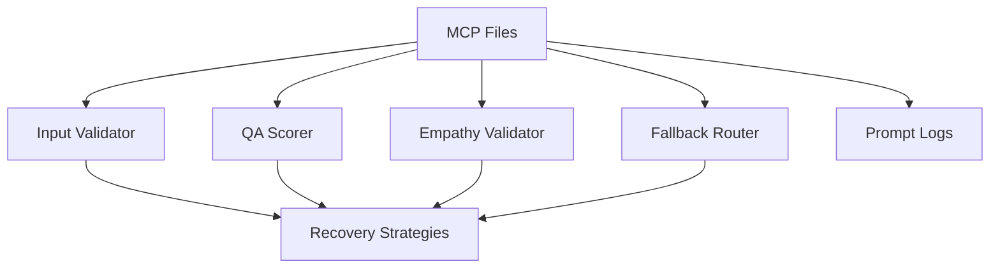
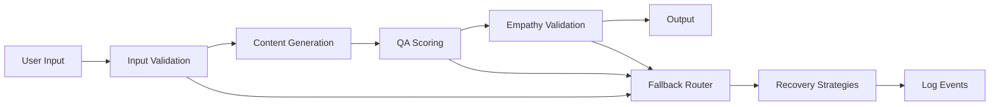

# Prompt Architecture Dependency Map

## Overview
This document provides a comprehensive dependency map of the prompt architecture, showing the relationships between components, their dependencies, and the flow of data through the system.

## Core Components

### 1. MCP Files
```
prompts/
├── ai_blueprint.mcp.ts
├── ai_brand_identity.mcp.ts
├── business-plan.mcp.ts
├── email_campaign.mcp.ts
├── reverse_strategy.mcp.ts
├── site_audit.mcp.ts
└── social_content.mcp.ts
```

### 2. Agent Components
```
cursor/agents/
├── input-validator.ts
├── qa-scorer.ts
├── empathy-validator.ts
└── prompt-logs.ts
```

### 3. Self-Healing Components
```
cursor/self-healing/
├── fallbackRouter.ts
└── recoveryStrategies.ts
```

## Dependency Graph

### 1. MCP Dependencies


### 2. Data Flow


## Component Dependencies

### 1. Input Validator
- **Dependencies**:
  - `recoveryStrategies.ts`
  - `prompt-logs.ts`
- **Exports**:
  - `validateInput()`
  - `inferMissingValues()`
  - `applyDefaults()`

### 2. QA Scorer
- **Dependencies**:
  - `recoveryStrategies.ts`
  - `prompt-logs.ts`
- **Exports**:
  - `scoreOutput()`
  - `optimizeContent()`
  - `applyTemplates()`

### 3. Empathy Validator
- **Dependencies**:
  - `recoveryStrategies.ts`
  - `prompt-logs.ts`
- **Exports**:
  - `validateEmpathy()`
  - `enhanceEmpathy()`
  - `applyTemplates()`

### 4. Fallback Router
- **Dependencies**:
  - `recoveryStrategies.ts`
  - `prompt-logs.ts`
- **Exports**:
  - `handleFallback()`
  - `selectRecoveryPath()`
  - `executeRecovery()`

### 5. Recovery Strategies
- **Dependencies**:
  - `prompt-logs.ts`
- **Exports**:
  - `primaryRecovery()`
  - `secondaryRecovery()`
  - `emergencyRecovery()`

### 6. Prompt Logs
- **Dependencies**: None
- **Exports**:
  - `logEvent()`
  - `trackMetrics()`
  - `generateReport()`

## Data Types

### 1. Input Types
```typescript
interface BaseInput {
  tone: string;
  metadata: {
    timestamp: string;
    version: string;
  };
}

interface AIBlueprintInput extends BaseInput {
  industry: string;
  targetAudience: string;
  goals: string[];
  constraints: string[];
}

// Similar interfaces for other MCPs
```

### 2. Output Types
```typescript
interface BaseOutput {
  score: {
    overall: number;
    components: Record<string, number>;
  };
  empathyMetrics: {
    tone: number;
    relevance: number;
    clarity: number;
  };
  metadata: {
    timestamp: string;
    version: string;
    trustScore: number;
  };
}

interface AIBlueprintOutput extends BaseOutput {
  blueprint: {
    strategy: string;
    implementation: string;
    timeline: string;
  };
}

// Similar interfaces for other MCPs
```

## Recovery Paths

### 1. Primary Path
```
Input → Validation → Generation → Scoring → Empathy → Output
```

### 2. Secondary Path
```
Input → Validation → Template → Generation → Scoring → Output
```

### 3. Emergency Path
```
Input → Validation → Cache → Output
```

## TAP Integration

### 1. Trust Score Calculation
```typescript
interface TrustScore {
  overall: number;
  components: {
    input: number;
    generation: number;
    scoring: number;
    empathy: number;
  };
  metadata: {
    timestamp: string;
    version: string;
  };
}
```

### 2. TAP Metadata
```typescript
interface TAPMetadata {
  codexVersion: string;
  trustScoreThreshold: number;
  lastUpdated: string;
  status: 'Locked' | 'Pending';
}
```

## Version Control

### 1. MCP Versions
- `ai_blueprint.mcp.ts`: v1.0.0
- `ai_brand_identity.mcp.ts`: v1.0.0
- `business-plan.mcp.ts`: v1.0.0
- `email_campaign.mcp.ts`: v1.0.0
- `reverse_strategy.mcp.ts`: v1.0.0
- `site_audit.mcp.ts`: v1.0.0
- `social_content.mcp.ts`: v1.0.0

### 2. Agent Versions
- `input-validator.ts`: v1.0.0
- `qa-scorer.ts`: v1.0.0
- `empathy-validator.ts`: v1.0.0
- `prompt-logs.ts`: v1.0.0

### 3. Self-Healing Versions
- `fallbackRouter.ts`: v1.0.0
- `recoveryStrategies.ts`: v1.0.0

## TAP Status
- **Codex Version**: v6.1.4
- **Trust Score Threshold**: 4.2
- **Last Updated**: 2024-03-21
- **Status**: Locked 