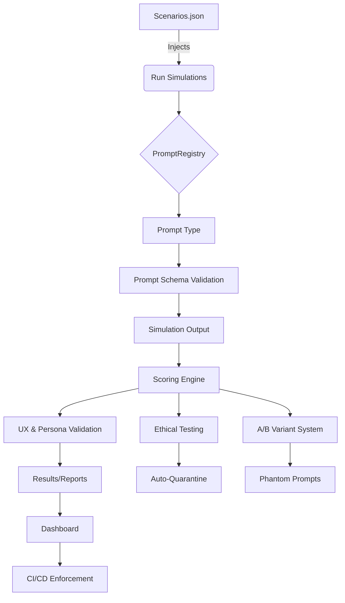

# 🧪 Clarity Simulation System (CBSE v2.5)

**Codex Business Simulation Engine**

---

## 🌐 Purpose
Stress-test, validate, and elevate CanAI using real-world, persona-aligned business scenarios. Every scenario is a proving ground for clarity, trust, and transformation.

---

## 🗺️ Architecture Flowchart

---

## 🚀 How to Add a Scenario
1. Edit `scenarios.json`.
2. Add a new object with:
   - `id`, `title`, `industry`, `persona_background`, `pain_area`, `locale`, `ethical_flag`
   - `prompt_type`, `weak_input`, `strong_input`, `simulated_user_response`
3. Ensure diversity: industries, ethical dilemmas, HR, localization.
4. Save and commit.

---

## 📊 How to Interpret Reports
- **results/{scenario_id}.json**: Raw simulation output, scores, and logs.
- **reports/{scenario_id}-ux.json**: UX and persona validation, readability, tone, structure.
- **schema-align-errors.log**: Any schema mismatches or validation errors.
- **persona-watch.log.md**: Persona-level drift, trust, and empathy flags.
- **dashboard/clarity-engine-dashboard.json**: Aggregated scenario health, pass/fail, persona drift.

---

## 🏗️ Architecture Summary
- **Scenario System**: Diverse, realistic, and ethical business challenges.
- **Prompt Schema Alignment**: Validates all scenario inputs against real prompt schemas.
- **Simulation Runner**: Injects scenario data, logs outputs, handles retries and fallbacks.
- **Scoring Engine**: Multi-dimensional, persona-aware metrics for clarity, trust, empathy, actionability, bias.
- **UX & Persona Validation**: Ensures emotional and cognitive alignment.
- **Ethical Testing**: Bias, transparency, fairness, and auto-quarantine for failures.
- **A/B Variant System**: Phantom prompt benchmarking.
- **Dashboard**: Visualizes scenario health, trends, and persona impact.
- **CI/CD**: Blocks regressions, enforces trust and memory thresholds.
- **Continuous Evolution**: Quarterly scenario updates, changelog, validation.

---

## 🧬 Example Files
- `/examples/sample-scenario.json`
- `/examples/sample-report.json`
- `/examples/dashboard-mockup.png`

---

*Every scenario is a user's hope. Every weak input is a cry for clarity. Every failure is a second chance.* 